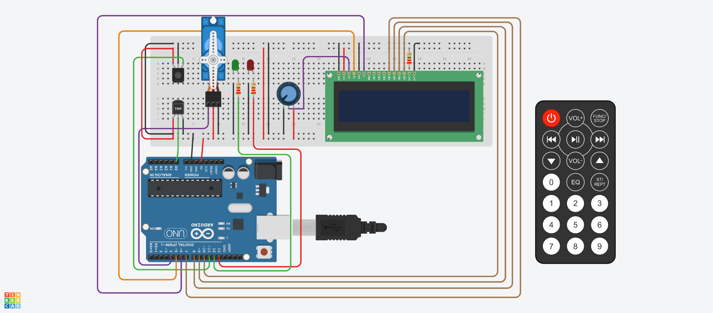

# 📋 Documentación proyecto Alarma de incendio.  

Sistema de deteccion de incendio desarrollado con un Arduino UNO sobre la plataforma Tinkercad. 

 Segundo Parcial materia `SPD - Tecnicatura en Programación UTN FA`.  
 Junio 2023

## Autor: ✒️
***
* **Fernando Malinowski (DIv 1ºG)** 
***

## Comenzando 🚀
***
La alarma se dispara al detectar una determinada temperatura. Al hacerlo simula una respuesta activando un cervo motor y un mensaje de alerta por el display LCD 16x2.
- La alarma se puede apagar/encender con el control IR (infra rojo), presionando el boton rojo.
- Consta de una resistencia ajustable para regular la incentidad de brillo del LCD   
- Una luz led verde que al encenderse indica que la la alarma esta encendida pero no se detectó incendio.La luz roja se prende cuando detecta indencio. Cuando el sistema esta apagado, los leds y el display LCD permaneces apagados.  
- En el display se muestra la estación del año (en funcion de unas temperaturas preestablecidas) y la temperatura altual. Si la temperatura supera los 60ºC se activa la alarma y muestra un mensaje de alerta.
- Si hay deteccion de incendio el servo motor se se posiciona a 180 grados( hacia la aprte superior en la imagen). 
 

Las siguientes instrucciones te permitirán comprender el funcionamiento del proyecto. Además, se incluye el enlace del proyecto en TinkerCad para poder copiarlo y modificarlo: 

[Link del proyecto en Tinkercad (para copiar, no colaborador)](https://www.tinkercad.com/things/cdLLI2wjXa5?sharecode=BZH8Aqm1zEYz31H5eDzE2P_rcCQk3Ddp8KysrEz6HUo "Enlace del proyecto en Tinkercad")

## Consigna 🔩
El objetivo de este proyecto es diseñar un sistema de incendio utilizando Arduino que pueda
detectar cambios de temperatura y activar un servo motor en caso de detectar un incendio.
Además, se mostrará la temperatura actual y la estación del año en un display LCD.

Componentes necesarios:  
-Arduino UNO  
-Sensor de temperatura (TMP36).  
-Control remoto IR (Infrarrojo)  
-Display LCD (16x2 caracteres)  
-Servo motor  
-Cables y resistencias según sea necesario  
-Protoboard para realizar las conexiones  
-Dos leds.  
-Funcionalidad requerida:  

## Código del programa:
  Principales parámetros:
- system_status:  
Es un booleano que representa el estado de todo el sistema (on/off). Se activa y desactiva con un boton del control remoto. 
- alarm_status:  
tambien un booleano que indica si detectó un incendio. Esta se activa en función de la temperatura_limite. Esta esta seteada en 60.0 ºC.  

* * *

 ~~~ C (Lenguaje del código)
/*
Fernando Malinowski Div 1º G
*/

#define sensor_temp A0
#define led_rojo 13
#define led_verde 12
#define sensor_ir 11

#define IR_BUTTON_0 12
#define IR_BUTTON_1 16
#define IR_BUTTON_2 17
#define IR_BUTTON_3 18
#define IR_BUTTON_4 20
#define IR_BUTTON_5 21
#define IR_BUTTON_6 22
#define IR_BUTTON_7 24
#define IR_BUTTON_8 25
#define IR_BUTTON_9 26
#define IR_BUTTON_ON 0

float lectura;
float voltaje;
float temperatura;
float temperatura_limite = 60.0;
bool alarm_status = false;
bool system_status = true;

// Incluímos la librería para poder controlar el servo
#include <LiquidCrystal.h>
#include <Servo.h>
#include <IRremote.h>

//Declaraciond e variable que controla el servo
Servo servoMotor;

//LCD
LiquidCrystal lcd = LiquidCrystal(5,6,7,8,9,10);

byte grados[8] = {
  B01110,
  B01010,
  B01110,
  B00000,
  B00000,
  B00000,
  B00000,
};

//Sensor IR
int RECV_PIN = 11;
IRrecv irrecv(RECV_PIN); //creamos la variable u objeto para el receptor IR
decode_results Valor;

void setup()
{
  Serial.begin(9600);
  //PWM
  pinMode(led_rojo, OUTPUT);
  pinMode(led_verde, OUTPUT);
  //iniciamos el servo en el pin PWM 9
  servoMotor.attach(4);
  //Inicializamos el ángulo en 0
  servoMotor.write(0);
  lcd.begin(16,2);
  
  //setup sensor IR
  // inicializamos la recepción de datos
  IrReceiver.begin(sensor_ir); 
}

bool UpdateSistemStatus(bool system_status)
{
   if (IrReceiver.decode())
  {
    Serial.println(IrReceiver.decodedIRData.command);
    switch (IrReceiver.decodedIRData.command)
    {
      case 0:
      	Serial.println("On/OFF");
      	system_status = !system_status;
      	break;
    }
    IrReceiver.resume();
  }
  return system_status;
}

float MedirTension(int sensor_temp)
{
  float lectura = analogRead(sensor_temp);
  float voltaje = (5.0/1024)*lectura;
  return voltaje;
}

float ConvertirTemp(float tension)
{
  temperatura = (tension*100)-50;
  return temperatura;
}

float UpdateTemperature(int pin_sensor)
{
  float tension = MedirTension(pin_sensor);
  float temperatura = ConvertirTemp(tension);
  return temperatura;
}

bool UpdateAlarmStatus(float temperatura,
                       float max_temp,
                       bool alarm_status,
                      bool system_status)
{
  if (system_status && temperatura > max_temp)
  {
    alarm_status = true;
  }
   else
    {
     alarm_status = false;
    }
  return alarm_status;
}

void UpdateServo(bool alarm_status,
                 bool system_status)
{
  if (alarm_status)
  {
    {
       servoMotor.write(180);
    }
  }
  else
  {
    servoMotor.write(0);
  }
}

void UpdateLeds(bool alarm_status,
                bool system_status)
{
  if (system_status)
  {
      if (!alarm_status)
    {
      digitalWrite(led_verde, 1);
      digitalWrite(led_rojo, 0);

    } 
    else
    {
      digitalWrite(led_rojo, 1);
      digitalWrite(led_verde, 0);
    }
  }
  else
  {
    digitalWrite(led_verde, 0);
    digitalWrite(led_rojo, 0);
  }  
}

String PredecirEstacion(float temperatura)
{
  String estacion = "invierno";
  if (temperatura < 13.0)
  {
    estacion = "Invierno.";
  } 
  else
  {
    if (temperatura >= 13.0 && temperatura < 20.0)
    {
      estacion = "Otoño.";
    }
    else
    {
      if (temperatura >= 20.0 && temperatura < 26.0)
      {
        estacion = "Primavera.";
      }
      else
      {
          if (temperatura > 26.0)
        {
          estacion = "Verano.";
        }
      }
    }
  }
  return estacion;
}

void UpdateLcd(float temperatura,
               bool alarm_status,
               bool system_status)
{
  
  lcd.clear();
  
  if (system_status)
  {
      if (!alarm_status)
    {
      String estacion = PredecirEstacion(temperatura);
      lcd.setCursor(3,0);
      lcd.print(estacion);
    }
    else
    {
      lcd.setCursor(3,0);
      lcd.print("--ALERTA--");
    }

    lcd.setCursor(4,1);
    lcd.print(temperatura, 1);
    lcd.createChar(0,grados);
    lcd.setCursor(9,1);
    lcd.write(byte(0));
    lcd.setCursor(10,1);
    lcd.print("C");
    
  }
  else
  {
    lcd.setCursor(4,0);
    lcd.print("SYSTEMA");
    lcd.setCursor(4,1);
    lcd.print("APAGADO");
  }
}

  
void loop()
{ 
  temperatura = UpdateTemperature(sensor_temp);
  
  alarm_status = UpdateAlarmStatus(temperatura,
                                   temperatura_limite,
                                   alarm_status,
                                   system_status);
  
  UpdateLcd(temperatura,
            alarm_status,
            system_status);
    
  Serial.println(temperatura);
  
  UpdateLeds(alarm_status,system_status);
  
  UpdateServo(alarm_status,
              system_status);
    
  system_status = UpdateSistemStatus(system_status);
  Serial.print("alarm: ");
  Serial.println(alarm_status);
  Serial.print("system: ");
  Serial.println(system_status);
  delay(200);
}
 ~~~ C
bool UpdateSistemStatus(bool system_status)
{
   if (IrReceiver.decode())
  {
    Serial.println(IrReceiver.decodedIRData.command);
    switch (IrReceiver.decodedIRData.command)
    {
      case 0:
      	Serial.println("On/OFF");
      	system_status = !system_status;
      	break;
    }
    IrReceiver.resume();
  }
  return system_status;
}
 ~~~
   
Esta función recibe la señal, la decodifica y la imprime por consola serial. Si detecta que se presionó el boton On/Off realiza la negacion de el parámetro system_status y lo retorna.

## Convierte de valor analogico a tension:
 ~~~ C
  float MedirTension(int sensor)
{
  float lectura = analogRead(sensor);
  float voltaje = (5.0/1024)*lectura;
  return voltaje;
}
 ~~~

Esta interpreta la señal analógica del sensor de temperatura tmp36 (ver datasheet al final del documento). El valor que recibe el Arduino de la entrada analogica puede ir de cero (cuando detecta 0 V)a 1024 (cuando detecta 5 v). Por lo tanto la mínima resolucion es de 5V/1024. Por lo que este es el coeficiente al que hay que multiplicar el valor recibido del sensor de temperatura para obtener el voltaje de salida del mismo.

## Convierte de tension a temperatura:
 ~~~ C
float ConvertirTemp(float tension)
{
  temperatura = (tension*100)-50;
  return temperatura;
}
 ~~~  
Si vemos la hoja de datos del TMP36 vemos que el voltaje entregado es linealmente proporcional a la temperatura, con una relacion de: 10mv/ºC. Por lo que si queremos obtener la relacion de ºC/V debemos elevar todo a la menos uno y aplicar la conversion 1mv = 1000V. Por lo que quedaría:  
- T(ºC) =(Vout)*100ºC/V + b.  
Donde Vout es la salida del sensor y b es el termino independiente de una recta.  
A 0ºC el sensor no entrega 0V. De la hoja de datos obtenemos que a 25ºC el sensor entrega 750mv. Por lo que de la ecuacion anterior se deduce que b = -50V. De esta forma se puede calcular la temperatura en función del voltaje antes medido.

## Convierte valor de lectura analógico a temperatura(ºC):
~~~ C
  float UpdateTemperature(int pin_sensor)
{
  float tension = MedirTension(pin_sensor);
  float temperatura = ConvertirTemp(tension);
  return temperatura;
}
~~~

Esta función utiliza las funciones antes mensionadas para obtener como parámetro el valor de la entrada analógica donde esta conectado la lecta del sensor de temperatura para devolver una temperatura en grados centígrados como numero flotante.  

## activa la alrma si la temperatura alcanza un valor preestablecido:
~~~ C
bool UpdateAlarmStatus(float temperatura,
                       float max_temp,
                       bool alarm_status,
                      bool system_status)
{
  if (system_status && temperatura > max_temp)
  {
    alarm_status = true;
  }
   else
    {
     alarm_status = false;
    }
  return alarm_status;
}
~~~

Si la temperatura de lectura alcanza un máximo, retorna alarm_status = true. Este booleano se utiliza para activar la alerta por display y activar el servomotor (simulando la activacion de un dispositivo).

### Control de leds:
~~~ C
void UpdateLeds(bool alarm_status,
                bool system_status)
{
  if (system_status)
  {
      if (!alarm_status)
    {
      digitalWrite(led_verde, 1);
      digitalWrite(led_rojo, 0);

    } 
    else
    {
      digitalWrite(led_rojo, 1);
      digitalWrite(led_verde, 0);
    }
  }
  else
  {
    digitalWrite(led_verde, 0);
    digitalWrite(led_rojo, 0);
  }  
}
~~~
- Si el sistema y la larmarma de incendio estan activos prende led rojo. Si no detecta incendio, la verde.
- Si el sistema esta apagado, las luces también.

### controla el servo-motor:
~~~ C
void UpdateServo(bool alarm_status,
                 bool system_status)
{
  if (alarm_status)
  {
    {
       servoMotor.write(180);
    }
  }
  else
  {
    servoMotor.write(0);
  }
}
~~~
- Si el sistema esta encendido y la alarma también posiciona el servo a 180º, sinó lo deja en la posicion de reposo (0º).

### Estación en función d ela temperatura:
~~~ C
void UpdateServo(bool alarm_status,
                 bool system_status)
{
  if (alarm_status)
  {
    {
       servoMotor.write(180);
    }
  }
  else
  {
    servoMotor.write(0);
  }
}
~~~
- Valores preestablecidos de temperatura para cada estación. Sin lugar a dudas, es el método mas efectivo para saber la estación del año en la que te encuentras, ¿o no?.

### Control del display LCD:
~~~ C
void UpdateLcd(float temperatura,
               bool alarm_status,
               bool system_status)
{
  
  lcd.clear();
  
  if (system_status)
  {
      if (!alarm_status)
    {
      String estacion = PredecirEstacion(temperatura);
      lcd.setCursor(3,0);
      lcd.print(estacion);
    }
    else
    {
      lcd.setCursor(3,0);
      lcd.print("--ALERTA--");
    }

    lcd.setCursor(4,1);
    lcd.print(temperatura, 1);
    lcd.createChar(0,grados);
    lcd.setCursor(9,1);
    lcd.write(byte(0));
    lcd.setCursor(10,1);
    lcd.print("C");
    
  }
  else
  {
    lcd.setCursor(4,0);
    lcd.print("SYSTEMA");
    lcd.setCursor(4,1);
    lcd.print("APAGADO");
  }
}

~~~
- Si el systema es prendido y la larma de incencio desactivada muestra la estación del año y la temperatura enºC.
- Si se activa la alarma muestra un mensaje de larta y la temperatura.
- Si el sistema esta apagado, te lo muestra, claro.

### Loop del programa:
~~~ C
void loop()
{ 
  temperatura = UpdateTemperature(sensor_temp);
  
  alarm_status = UpdateAlarmStatus(temperatura,
                                   temperatura_limite,
                                   alarm_status,
                                   system_status);
  
  UpdateLcd(temperatura,
            alarm_status,
            system_status);
    
  Serial.println(temperatura);
  
  UpdateLeds(alarm_status,system_status);
  
  UpdateServo(alarm_status,
              system_status);
    
  system_status = UpdateSistemStatus(system_status);
  Serial.print("alarm: ");
  Serial.println(alarm_status);
  Serial.print("system: ");
  Serial.println(system_status);
  delay(200);
}
~~~
- Realiza la ejecución del código en el orden correcto y cada 200 ms.
- Imprime el valor de el sistema y la alarma por consola serial (0 - off, 1 -on)

## 🤖 Link al proyecto 
---

 Proyecto [Link colaborador Tinkercad]([https://www.tinkercad.com/things/11JbVPn2ngt](https://www.tinkercad.com/things/cdLLI2wjXa5-detector-incendio/editel?sharecode=dMTs8mi-D6_ne6f99F5Q16aijBYtbci-BFEqyaH6hBY) "Enlace del proyecto en Tinkercad") TinkerCad.
 - - - 

##  📘 Fuentes
---
- [Tecnicatura Universitaria en Programación - UTN](http://www.sistemas-utnfra.com.ar/#/pages/carrera/tecnico-programacion/resumen).
- [Pushing commits to a remote repository](https://docs.github.com/en/enterprise-server@3.5/get-started/using-git/pushing-commits-to-a-remote-repository "Use git push to push commits made on your local branch to a remote repository.").

- [Consejos para documentar](https://www.sohamkamani.com/how-to-write-good-documentation/#architecture-documentation).

- [Lenguaje Markdown](https://markdown.es/sintaxis-markdown/#linkauto).

- [Markdown Cheatsheet](https://github.com/adam-p/markdown-here/wiki/Markdown-Cheatsheet).

- [Emojis](https://gist.github.com/rxaviers/7360908).  

- [IR Remote guide](
https://roboticsbackend.com/arduino-ir-remote-controller-tutorial-setup-and-map-buttons/).  

- [LCD 12x2 gruide](
https://www.electrogeekshop.com/como-usar-un-lcd-de-16x2-caracteres-con-arduino/).

- [TMP36 Data Sheet](https://www.analog.com/media/en/technical-documentation/data-sheets/TMP35_36_37.pdf).

